# Handoff: Haul fulfillment flow (order → warehouse → QC → parcel → received)

## Overview

Credenza Fashion is an agent haul planner. Users buy from Chinese marketplaces (Taobao, Weidian, Yupoo, 1688) through a shopping agent. Today the product stops at "you built a haul" — a named group of saved items with a running goods total.

This handoff covers everything **after** the haul exists: ordering through the agent, items arriving at the agent's warehouse, reviewing the agent's QC photos and green/red-lighting each article, packing a parcel with real chargeable-weight maths, handing that parcel off to the agent, and tracking it home.

**The governing constraint: Credenza never touches the agent.** It does not take money, submit orders, request returns, or poll tracking. Every stage transition is something the user marks by hand. Where an action must happen on the agent's site, Credenza's job is to *write the message and hand it over*. This is not a temporary limitation to be engineered away — it is the product's stated posture ("A planner, not a store"), and copy throughout the flow says so out loud. An API integration with agents is a future aspiration, not the design assumption.

## About the design files

The files in this bundle are **design references created in HTML** — prototypes showing intended look and behavior, not production code to copy. They are authored as Design Components: a single `.dc.html` file with an inline template and a logic class, running on a small local runtime (`support.js`).

The task is to **recreate these designs in the target codebase's existing environment** (the real Credenza app is local-first React) using its established patterns, components, and state layer. If no environment exists yet, choose the framework that fits and implement there. Do not ship the HTML.

The real component library already exists upstream at **github.com/sportskoat/credenza** (branch `main`) — `credenza-fashion.jsx` holds `PALETTES` and the shelf, `credenza-fashion.css` holds every `.cz-*` rule with dated comments explaining each value, `components/` and `sheets/` hold the primitives. **Build against those primitives, not against the markup in these prototypes.** Where this document names a design-system component (`Button`, `BuyButton`, `IconButton`, `Chip`, `SegmentedControl`, `SearchField`, `Kicker`, `Masthead`), use the shipped one.

## Fidelity

**High-fidelity.** Final colors, typography, spacing, motion, and interaction behavior. Every number in this document is the number in the prototype. The layout, copy, and state machine are all intended as specified.

Two caveats:

1. **Desktop only.** There are no media queries and no mobile layout. At 390px the board's 1072px column track side-scrolls, the QC modal's fixed 344px rail overflows, and the index grid crushes. Mobile is a real design pass that has not been done — see *Responsive behavior* for the intended direction, but treat it as unspecified.
2. **Product photography is stubbed.** Every image is a flat marketplace gradient tile (see *Assets*). Real 4:5 photography replaces them.

## Vocabulary

Use these words in code and in UI. They are the community's, and writing around them reads as an outsider.

| Term | Meaning |
| --- | --- |
| **Agent** | Shopping-agent service (Superbuy, Wegobuy, CSSBuy…). Buys on the user's behalf, warehouses goods, ships internationally. |
| **Haul** | A named group of items the user intends to buy and ship together. |
| **QC** | Quality-control photos the agent takes of an arrived item before shipping. |
| **GL / RL** | Green-light / red-light — accept the item, or reject it and ask the agent to return it. |
| **Parcel** | One box shipped from the agent's warehouse to the user. A haul can produce several. |
| **Line** | An international shipping service (EMS, GD-EUB, DHL) with its own per-kg rate and transit window. |
| **Chargeable weight** | `max(actual weight, volumetric weight)` — what the agent actually bills. |
| **Volumetric weight** | `(L × W × H in cm) ÷ divisor`, divisor 5000 or 6000 depending on agent and line. |
| **W2C** | "Where to cop" — the source link for an item. |
| **Storage clock** | Free warehouse storage window (Superbuy: 90 days), counted **per item from its own arrival**, not from haul creation. |

---

## The item state machine

One item moves through exactly five stages. This is the spine of the whole feature.

```
toOrder ──▶ ordered ──▶ warehouse ──▶ qcd ──▶ parcel
                                        │
                                        └── qc: "green" | "red"
```

| Stage | Meaning | How it advances | Card action |
| --- | --- | --- | --- |
| `toOrder` | In the haul, not bought | User marks, or copies links out | **Copy link** |
| `ordered` | Paid via the agent, in transit to their warehouse | User marks arrived | **Mark arrived** |
| `warehouse` | Physically at the agent, weighed, QC photos exist | User reviews QC | **Review QC · N** |
| `qcd` | Reviewed — `qc` is `green` or `red` | Green → parcel; red → return message | **Add to parcel** / **Return message** |
| `parcel` | In parcel A (or B, C…) | Parcel ships | remove (×) |

Rules that matter:

- **A red-lit item can never enter a parcel.** It is excluded from all weight and cost maths and is shown struck out of the box contents with "can't ship".
- **Stage is freely reversible.** The detail drawer lets the user click any stage directly — real hauls go backwards (item arrives damaged, goes back, comes again). Do not build a one-way wizard.
- **Mixed progress is the normal state.** Three items in QC while two haven't shipped from the seller is typical. Every screen must tolerate all five stages being occupied at once.
- **`actual` weight overwrites `est`** the moment the item reaches the warehouse, and the delta is surfaced ("your estimate was 400 g — +112 g out"). This teaches better estimating and, aggregated, gives you per-category weight data.
- **The storage clock is per item.** It starts on that item's arrival. Haul-level display shows the *earliest* expiry among items not yet in a parcel.

### Item model

```ts
type Stage = 'toOrder' | 'ordered' | 'warehouse' | 'qcd' | 'parcel';
type Verdict = 'green' | 'red' | null;

interface HaulItem {
  id: number;
  title: string;
  size: string;              // "Large", "43", "One size"
  price: number;             // USD goods cost
  platform: 'Taobao' | 'Weidian' | 'Yupoo' | '1688';
  est: number;               // user's weight estimate, grams
  actual: number | null;     // agent's weighed value, grams — overwrites est in all maths
  vol: number;               // volumetric contribution, cm³
  stage: Stage;
  qc: Verdict;
  reason: string | null;     // red-light reason key; drives the return message
  photos: number;            // count of QC photos uploaded
  storage: number | null;    // days of free storage left
  order: string;             // agent order number, e.g. "SB-8827101"
  when: string;              // human date for the current stage
}
```

---

# Every button and where it goes

Complete inventory. Anything not listed here does not exist in the design.

## Hauls index

| Control | Type | Goes to / does |
| --- | --- | --- |
| Search your shelf | `SearchField variant="bar"` | Filters the shelf. Not wired in the prototype. |
| **+ Stash** | `Button primary` | Opens the existing stash/paste flow. Out of scope here. |
| Shelf / Hauls · 4 | `SegmentedControl` | Switches between the shelf grid and this hauls view. |
| **Haul card** (photo collage) | `role="button"` on the whole card | → **board** for that haul. Always opens; never the CTA's destination. |
| **Card CTA** | `Button`, state-derived — see below | The one recommended next move. `stopPropagation` so it doesn't double-fire the card. |
| **Start a haul** tile | dashed placeholder | Creates a haul. Copy underneath: *"Add from any card's ··· menu"*. |

**The card CTA is derived from state, never authored.** Precedence, top to bottom:

| Condition | Flag badge | Label | Variant | Destination |
| --- | --- | --- | --- | --- |
| `pendingQC > 0` | `N at QC` | `Review QC · N` | primary | board **with the QC overlay already open** on the first unreviewed item |
| `submitted && milestone >= 3` | `Delivered` | `Open` | outline | board |
| `submitted` | `In transit` | `Track parcel A` | primary | tracking |
| `inParcel.length > 0` | chargeable weight | `Review & hand off` | primary | hand-off screen |
| `counts.warehouse > 0` | — | `Build the parcel` | primary | board |
| `counts.toOrder > 0` | — | `Start ordering` | outline | board |
| otherwise | — | `Open` | outline | board |

**Derive this from item and parcel state only — never from which screen is showing.** An early build gated the delivered branch on `screen === 'tracking'`, which is unreachable while the index is rendering, so the card was stuck advertising a parcel that had already arrived.

The one-click jump from index straight into the QC overlay is the highest-value shortcut in the feature. Build it.

## Board

| Control | Type | Goes to / does |
| --- | --- | --- |
| **‹ All hauls** | link + Lucide chevron-left | → index |
| **Share** | `Button outline` | Existing share-a-haul flow. Out of scope. |
| **Item card** | `role="button"` | Opens the **detail drawer** |
| **Copy link** (`toOrder`) | pill, `stopPropagation` | Copies that item's W2C to clipboard + toast |
| **Copy all links** (column footer) | dashed pill | Copies every unordered link `\n`-joined, for the agent's bulk-add box + toast |
| **Mark arrived** (`ordered`) | pill, `stopPropagation` | → `warehouse`; sets `actual ≈ est × 1.16`, `storage = 90`, `photos = 8` |
| **Review QC · N** (`warehouse`) | pill, `stopPropagation` | Opens the **QC overlay** on that item |
| **Review all QC** (column footer) | dashed pill | Opens the QC overlay on the first warehouse item |
| **Add to parcel** (`qcd` + green) | pill, `stopPropagation` | → `parcel` + toast |
| **Return message** (`qcd` + red) | pill, `stopPropagation` | Reopens the QC overlay at the red state |
| **×** on a parcel line | `IconButton` | Removes from the parcel → back to `qcd` |
| **5000 / 6000** | `Chip` pair | Sets the volumetric divisor; all maths recompute live |
| **Rate input** per line | number input, `stopPropagation` | Edits that line's $/kg; costs recompute live |
| **Line row** | `role="button"` | Selects the shipping line |
| **Review & hand off · N** | `BuyButton` | → hand-off. Empty parcel: label reads "Nothing in the box yet" and it refuses with a toast |
| **+ Parcel B** | dashed pill | Creates a second parcel. Not wired in the prototype. |

## Detail drawer

| Control | Goes to / does |
| --- | --- |
| **×** (`IconButton`) | Closes. Backdrop click also closes. |
| **Any of the five stage rows** | Sets the item's stage directly. This is the escape hatch for every out-of-order reality. |
| **Weight** input | Overwrites `actual` in grams; the parcel maths recompute |
| **Agent order no.** input | Stores the reconciliation string |
| **Review QC · N photos** (primary) | Opens the QC overlay, closes the drawer |
| **Add to parcel A** (outline) | Only when green and not already packed |
| **Move back to the shelf** (subtle) | Resets the item to `toOrder`, clears QC, weight, storage, order no. |

## QC overlay

| Control | Key | Goes to / does |
| --- | --- | --- |
| **‹ / ›** (`IconButton`) | `←` `→` | Previous / next photo, wrapping |
| **Thumbnail** | — | Jumps to that photo |
| **Green light** | `G` | Sets `qc: 'green'`, stage `qcd` |
| **Red light** | `R` | Sets `qc: 'red'`, stage `qcd`, defaults the reason to `stitching` |
| **Reason chip** ×6 | — | Sets the reason; **rewrites the message live** |
| **Copy for your agent · EN + 中文** | — | Clipboard + toast. Credenza never sends. |
| **Add to parcel A** (green branch) | — | → `parcel`, closes the overlay |
| **Next item →** | — | Next unreviewed warehouse item; label becomes "Done" when the queue is empty |
| **×** | `Esc` | Closes |

## Hand-off

| Control | Goes to / does |
| --- | --- |
| **‹ winter** | → board |
| **Add to the box** (green-lit leftovers) | → `parcel`; the box and all maths update in place |
| **Copy instruction** (outline) | Copies the bilingual parcel instruction + toast |
| **Declared value** input | Sets declared value; flips the warning at the $45.00 threshold |
| **Mark submitted to agent** (`BuyButton`) | → tracking, `milestone = 0`, toast |

## Tracking

| Control | Goes to / does |
| --- | --- |
| **‹ winter** | → board |
| **Milestone row** ×4 | Sets the milestone. `Received` reveals the fit questions. |
| **Tracking number** input | Stores the number |
| **Track ↗** | Opens the carrier. Not wired. |
| **tight / right / roomy** chips | Per-item fit answer, toggleable — feeds the next size recommendation |
| **Back to the board** | → board |

---

## Screens

Captures are in `screens/`. They were taken with backdrop blur disabled so the renderer produces clean text — **the shipping design is translucent** (see *Glass* under Design tokens). Minor text-wrap artifacts in the images are the capture engine, not the layout; the live prototype is the authority.

### 1 · Hauls index — the grid

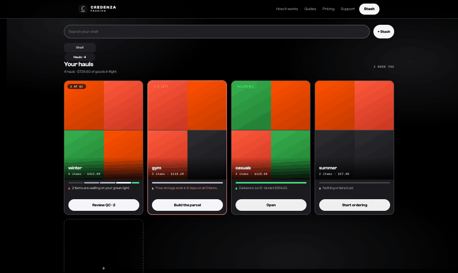

**Purpose:** before entering any haul, see which one needs you and why.

**Why this shape:** the previous index showed name, count, total — three facts that never change once the haul is built. Three directions were explored (this photo grid; a dense ledger with the stage rail spelled out; a "Needs you" strip above a grid — all three are in `wireframes/Hauls index.dc.html`). The grid won because nothing about the browsing feel changes — the collage still carries all the colour, and the product's whole appeal is that it looks like a wardrobe, not an order manager. The stage bar is four pixels of chrome that answers "how far along is this" without a word, and the note line is the only thing you actually read.

**Layout:** `max-width: 1180px`, `padding: 22px 28px 140px`.

1. Search + Stash row — `flex; gap: 12px; margin-bottom: 16px`. `SearchField` flexes, `Button primary` "+  Stash" is 112×44.
2. `SegmentedControl` in a `width: fit-content` wrapper, `margin-bottom: 28px`.
3. Section head — `<h2>` "Your hauls" (display 22px/600, `-0.035em`) with a right-aligned mono 10px/700 `+0.1em` uppercase `2 need you`; below it a 12.5px `--cz-sub` line `4 hauls · $726.60 of goods in flight`.
4. `display: grid; grid-template-columns: repeat(4, 1fr); gap: 14px`.

**Card anatomy** (radius 16px, glass, `overflow: hidden`, hover `translateY(-2px)` at 140ms; border `--cz-hair`, or `--cz-error-text` when urgent):

- **Collage** — `aspect-ratio: 4/5`, a 2×2 grid of item tiles with `gap: 1px` over `--cz-hair`, so the hairline draws the cross. Real photography replaces the tiles.
- **Name overlay** — absolute, bottom, `padding: 28px 13px 12px`, `linear-gradient(to top, rgba(0,0,0,.88), transparent)`, `pointer-events: none`. Haul name in display 16px/600 `-0.03em` white; below it mono 10px/700 `+0.04em` `rgba(255,255,255,.72)` — `9 items · $422.00`.
- **Flag badge** — absolute `top: 10px; left: 10px`, radius 999, `padding: 4px 10px`, 10px backdrop blur, mono 9px/800 `+0.08em` uppercase, `white-space: nowrap`. Urgent: `--cz-error-bg` / `--cz-error-text`. Delivered: `--cz-money-bg` / `--cz-money`. Otherwise `rgba(0,0,0,.62)` / white. **Absent entirely when there is nothing to say** — an always-present badge is noise.
- **Stage bar** — `display: flex; gap: 2px; height: 4px`. One segment per *occupied* stage, `flex` proportional to that stage's item count, radius 999. Ramp: `toOrder` `--cz-hair` → `ordered` `--cz-faint` → `warehouse` `--cz-sub` → `qcd` `--cz-ink` → `parcel` `--cz-money`. Progress reads as the bar filling with ink and finally going green.
- **Note line** — a 6px dot + 12px/1.35 sentence, `min-height: 34px` so price rows share a baseline across the row. Dot and text colour by tone: urgent `--cz-error-text`, attention `--cz-warn` dot on `--cz-ink` text, done `--cz-money` dot on `--cz-sub`, idle `--cz-faint`.
- **CTA** — full-width `Button`, 40px.

The four cards demonstrate the four tones: winter *attention* (2 at QC), gym *urgent* (6 d left), casuals *done* (Delivered), summer *idle* (no flag).

### 2 · Board — arrival state

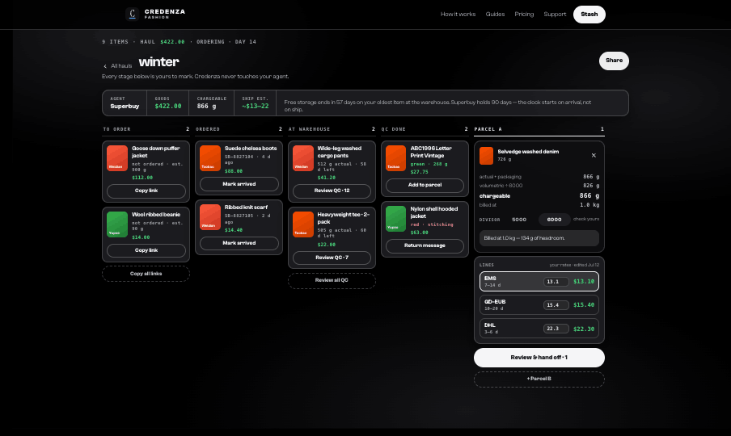

**Purpose:** the working surface for one haul. Everything visible at once, mixed states native.

Four alternatives were wireframed (a linear five-step rail, this board, a spreadsheet-style manifest, a parcel-first calculator, and a chronological log — all in `wireframes/Haul ordering flow.dc.html`). The board won because **mixed progress is the normal state of a haul** and a board renders it natively where a stepper fights it, and because the parcel is just another column — so partial shipping and Parcel B need no new concept.

**Layout:** `max-width: 1180px`, `padding: 20px 28px 140px`.

1. Kicker line — `Kicker` "9 items · haul", mono goods total in `--cz-money`, mono `· ORDERING · DAY 14` in `--cz-faint`.
2. Title row — back link, `<h1>` "winter" (display 30px/600, `-0.035em`, `line-height: 1.05`), spacer, "Share".
3. Sub-line, 13px `--cz-sub`: *"Every stage below is yours to mark. Credenza never touches your agent."*
4. **Summary strip** — one bordered 14px-radius bar, cells split by `1px solid var(--cz-hair)`, each `padding: 12px 16px`, a mono 9px/700 `+0.1em` uppercase `nowrap` label over a mono 13.5px/700 value: **Agent** · **Goods** · **Chargeable** · **Ship est.** · then a flexing cell with the storage sentence in 12.5px `--cz-sub`.
5. Columns — `flex; gap: 10px; overflow-x: auto`.

**Column widths are load-bearing:** four stage columns at **188px** + parcel panel at **280px** + four 10px gaps = **1072px**, inside a 1124px content box. Do not widen the columns without widening the container.

**Column header:** `Kicker size={10}` label, spacer, mono 11px/700 count, `padding: 0 2px 8px`, `border-bottom: 1px solid var(--cz-hair)`, `white-space: nowrap`. The parcel column's rule is `--cz-ink` instead — it is the destination, and the heavier rule says so.

**Item card** (`padding: 9px`, radius 12px, glass, hover `translateY(-2px)` + `--cz-inset-bg`): 44×55 platform tile with the platform name in display 8px/600 bottom-left; title display 12.5px/600 `-0.03em` clamped to 2 lines; meta line mono 9.5px/700 coloured by state (`--cz-faint`, `--cz-money` green, `--cz-error-text` red); price mono 10.5px/700 `--cz-money`; then the action pill — full width, `min-height: 30px`, radius 999, `1px solid var(--cz-hair-strong)`.

### 3 · QC review — open

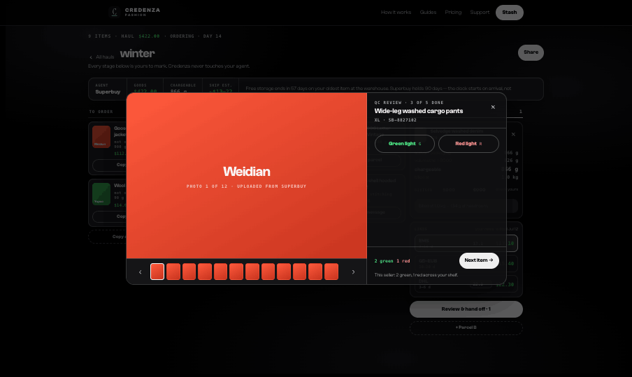

The screen that has to be fast. A user reviewing twelve items should be done in ninety seconds.

Modal `max-width: 940px`, `height: min(680px, 88vh)`, radius 20px, `0 30px 80px rgba(0,0,0,.6)`. Backdrop `rgba(0,0,0,.62)` + 6px blur, 32px page padding.

**Left — photo pane** (flexes, `min-height: 280px`): the photo fills it. Below, a `--cz-strip-bg` strip: `IconButton` chevron-left, a scrolling row of 34×42 thumbnails (`2px solid var(--cz-ink)` on the current one, transparent otherwise), `IconButton` chevron-right.

**Right — decision rail** (`flex: 0 0 344px`, scrolls): `Kicker` counter (`QC review · 3 of 5 done`), title, mono `size · order no.`, `IconButton` close. Then the verdict pair, side by side, `min-height: 44px`, radius 999, with the keyboard hint in mono 10px at 0.7 opacity. Inactive is `1.5px solid var(--cz-hair-strong)` on transparent.

Footer, pushed down with `margin-top: auto`: running `2 green · 1 red` counts, "Next item →", and *"This seller: 2 green, 1 red across your shelf."* Seller reputation falls out of QC for free — it is the most valuable byproduct in the feature.

**Keyboard, bound at the window while open:** `←` `→` photos · `G` green · `R` red · `Esc` close. This is the single highest-leverage detail in the design.

### 4 · QC — green light

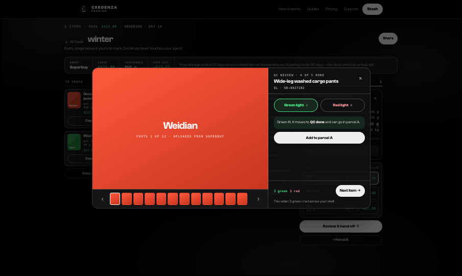

Verdict button fills `--cz-money-bg` with a `--cz-money` border. A `--cz-money-bg` confirmation panel appears — *"Green-lit. It moves to **QC done** and can go in parcel A."* — with an outline **Add to parcel A** so the user never has to go find the card again.

### 5 · QC — red light and the return message

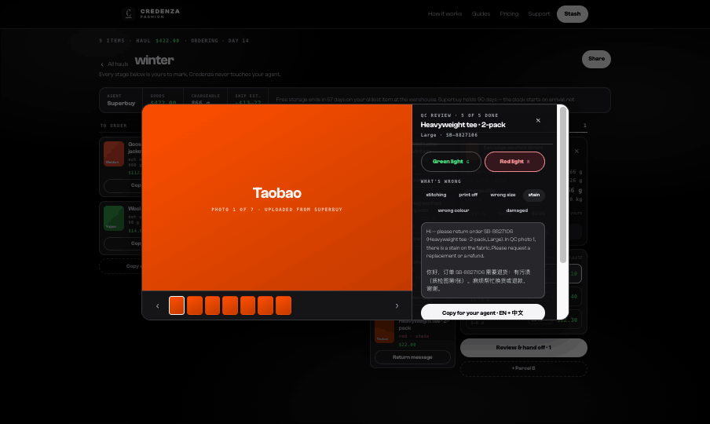

Red fills `--cz-error-bg` with a `--cz-error-text` border and reveals the reason chips. **Picking a chip rewrites the message live**, in English and Chinese, with the item's order number and the photo index the user is currently looking at.

Then: **Copy for your agent · EN + 中文**, and underneath, in 11.5px `--cz-faint`: *"You send it. Credenza only writes it — your agent has to receive the request from you."* This sentence is the product's whole posture in one line. Do not cut it.

### 6 · Board after QC

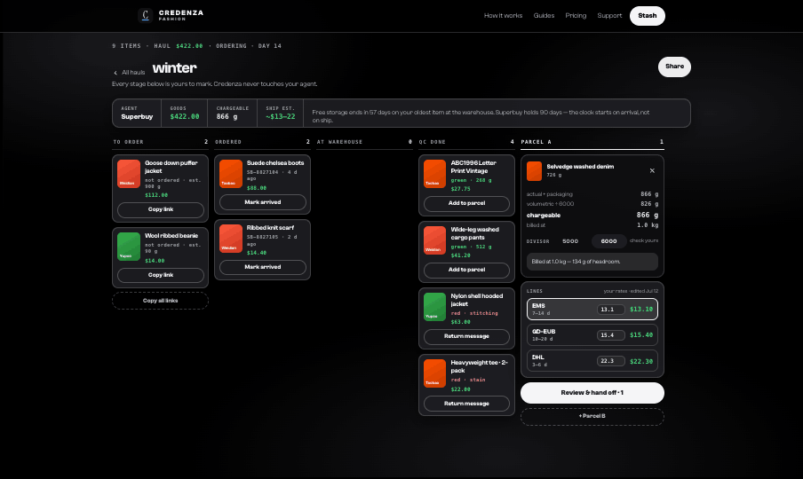

The QC done column now holds green and red items side by side, each with the right action — **Add to parcel** or **Return message**. The red-lit items carry `red · stitching` / `red · stain` in `--cz-error-text` and are permanently ineligible for the box.

### 7 · Board with the parcel filled

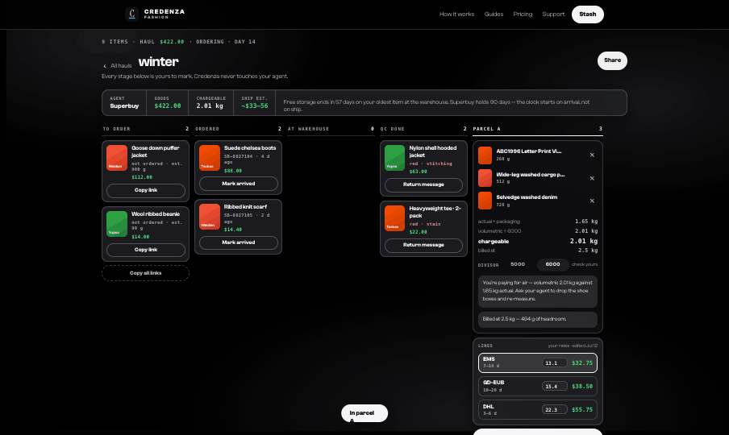

**Parcel A panel** — three stacked cards:

*Contents + maths* (radius 14px, elevated glass): each item as a 30×38 tile, name 12px/650 ellipsised, mono 9.5px weight, `IconButton` × to remove. Empty state is a dashed 11px-radius box — *"Nothing in the box. Green-lit items get an **Add to parcel** button."* Then a hairline and four rows: `actual + packaging`, `volumetric ÷ 6000`, **`chargeable`** (12.5px/650 label, mono 14px/700 value), `billed at`. Then the divisor chips and "check yours". Then the tips in `--cz-accent-bg`, radius 11px, 11.5px/1.45.

*Lines* (radius 14px): "your rates · edited Jul 12" in the header. Each row — name 12px/650 over transit window mono 9.5px, an editable 56px rate input, the cost in mono 12.5px/700 `--cz-money`. Selected takes `border: 1px solid var(--cz-ink)` and `background: var(--cz-accent-bg)`.

*Actions:* `BuyButton` "Review & hand off · N", then a dashed **+ Parcel B**.

### 8 · Item detail drawer

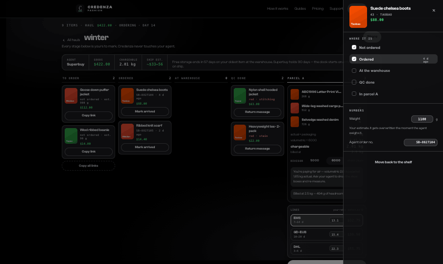

`position: fixed`, right edge, full height, **352px**, `border-left: 1px solid var(--cz-hair)`, heavy glass. Backdrop `rgba(0,0,0,.5)` + 6px blur, click-to-close.

Header: 62×78 tile, title display 16px/600, mono size line, mono 13px `--cz-money` price, `IconButton` close. **Where it is:** the five stages as tappable rows — completed and current take a filled 16px check marker, the current row also takes `--cz-accent-bg`. **Numbers:** weight in grams with the estimate-delta note (*"Your estimate was 1.10 kg — +40 g out."*), agent order number, and the storage note in an `--cz-accent-bg` box. Then the three actions.

### 9 · Hand-off

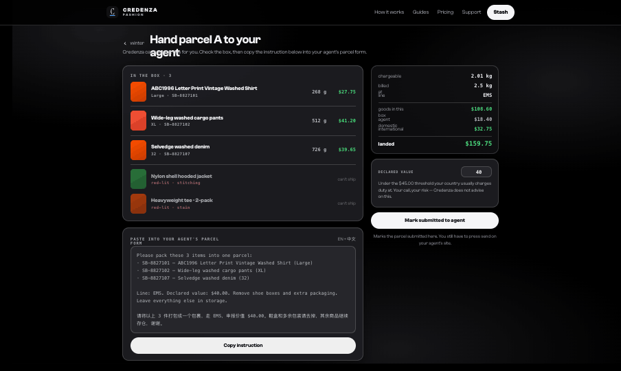

**Purpose:** the moment the app admits it cannot act for you. How gracefully it does this sets the tone for the whole product.

`max-width: 1000px`. Back link, `<h1>` "Hand parcel A to your agent", then: *"Credenza can't submit this for you. Check the box, then copy the instruction below into your agent's parcel form."*

Two columns, `gap: 20px`; left flexes, right is `flex: 0 0 320px`.

**Left — In the box:** each packed item as a 40×50 tile + title 13.5px/650 + mono 10px `size · order no.` + weight + price, hairline-separated.

Then **what stays behind**, in three honest states:

| Item state | Sub-line | Right side | Opacity |
| --- | --- | --- | --- |
| Red-lit | `red-lit · stitching` in `--cz-error-text` | "can't ship" | 0.62 |
| Not reviewed | `not reviewed yet · 12 photos` | "stays behind" | 0.62 |
| **Green-lit** | `green-lit · 268 g · fits in your headroom` in `--cz-money` | **Add to the box** button | 1 |

That third row is the point of the section. A green-lit item left out of the box costs a second parcel for nothing, so it gets full opacity and a money-green action, not a greyed-out line.

**Left — the instruction:** a mono 11.5px/1.65 block on `--cz-inset-bg` inside a hairline, `white-space: pre-wrap`, plus **Copy instruction**.

**Right — cost summary:** chargeable, billed at, line, then goods in this box, agent domestic ($18.40), international, hairline, **landed** in mono 16px/700 `--cz-money`.

**Right — declared value:** one 78px number input and one flat warning at the $45.00 threshold. Both branches end the same way: *"Your call, your risk — Credenza does not advise on this."* No optimisation advice — this is a customs-fraud liability boundary and the copy must not cross it.

**Right — Mark submitted to agent**, and under it, centered: *"Marks the parcel submitted here. You still have to press send on your agent's site."*

### 10 · Tracking

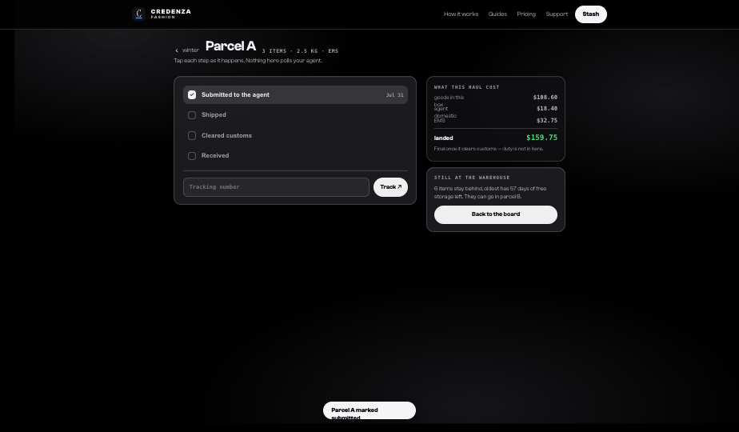

`max-width: 900px`. Header: back link, `<h1>` "Parcel A", mono meta `3 ITEMS · 2.5 KG · EMS`. Sub-line: *"Tap each step as it happens. Nothing here polls your agent."*

Four tappable milestone rows: an 18px rounded-6px marker (`1.5px` border; filled `--cz-action-fill` with a white Lucide check when done), label 13.5px/650, mono 10.5px date. Current row takes `--cz-accent-bg`. Below a hairline: tracking-number input and **Track ↗**.

Right: **what this haul cost**, footnote *"Final once it clears customs — duty is not in here."*, and **still at the warehouse** with the remaining count and earliest storage expiry.

### 11 · Received — closing the loop

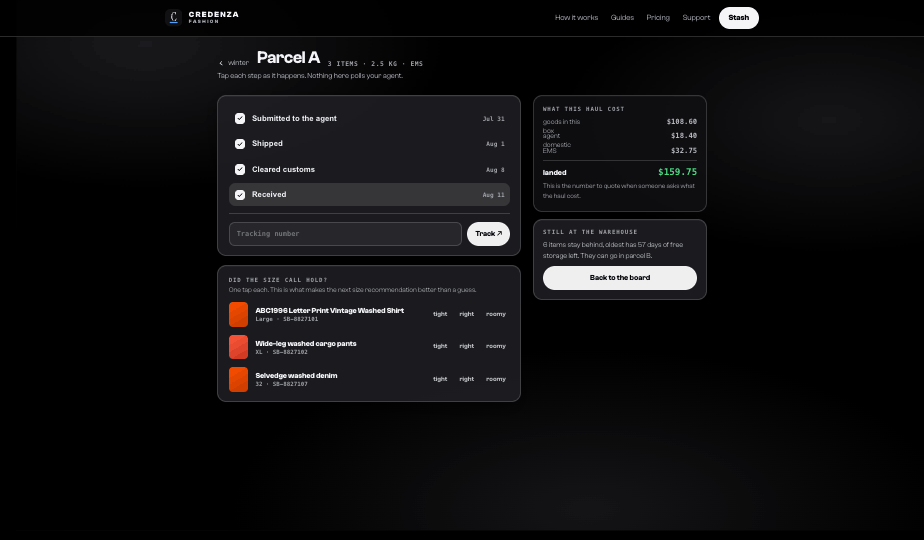

Reaching `Received` reveals the fit questions: per item a 34×42 tile, title, mono size line, and three toggleable `Chip`s — `tight` / `right` / `roomy`. Header copy: *"One tap each. This is what makes the next size recommendation better than a guess."*

The cost footnote flips to: *"This is the number to quote when someone asks what the haul cost."*

### 12 · Index, in transit

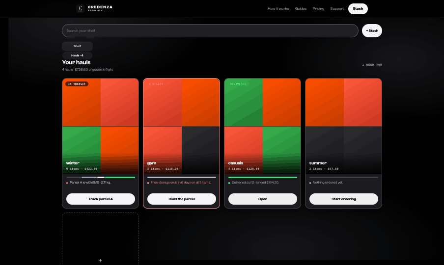

Submitting the parcel does not send the user back to a finished state — the haul is now *in flight*. Winter's flag reads `In transit`, the note names the line and chargeable weight (*"Parcel A is with EMS · 2.71 kg."*), and the CTA becomes **Track parcel A**, pointing at the tracking screen rather than the board. This is the state a haul sits in longest, so it has to say something useful.

### 13 · Index, delivered

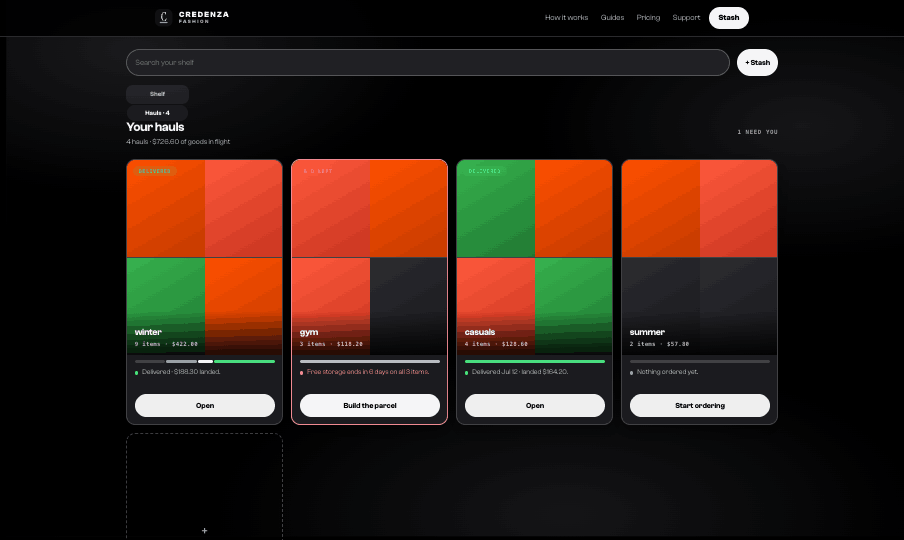

Once the parcel is marked received, winter's flag turns `Delivered` in money green, the stage bar is fully green, the note reads the landed total (*"Delivered · $189.30 landed."*), the CTA relaxes to outline **Open**, and the header count drops from `2 need you` to `1`. **The index is a projection of item and parcel state — never a stored status, and never derived from which screen is showing.** This screen is the proof.

---

## Generated messages

Credenza writes; the user sends. Both are bilingual because agent support staff read Chinese faster and the English half lets the user verify what they're sending.

**Red-light return request** — six reason keys, each carrying an English and a Chinese clause:

| Key | English | Chinese |
| --- | --- | --- |
| `stitching` | the stitching is coming apart | 走线开裂 |
| `print off` | the print is off-centre | 印花偏位 |
| `wrong size` | the size sent is not the size ordered | 尺码发错 |
| `stain` | there is a stain on the fabric | 有污渍 |
| `wrong colour` | the colour does not match the listing | 颜色不符 |
| `damaged` | the item arrived damaged | 有破损 |

```
Hi — please return order {order} ({title}, {size}). In QC photo {n}, {clause_en}.
Please request a replacement or a refund.

你好，订单 {order} 需要退货：{clause_zh}（质检图第{n}张）。麻烦帮忙换货或退款，谢谢。
```

The photo index is the one the user was looking at when they flagged it — that specificity is what makes the request actionable.

**Parcel hand-off:**

```
Please pack these {n} items into one parcel:      ← singular: "Please pack this item into one parcel:"
· {order} — {title} ({size})
…

Line: {line}. Declared value: {declared}. Remove shoe boxes and extra packaging.
Leave everything else in storage.

请将以上 {n} 件打包成一个包裹，走 {line}，申报价值 {declared}。鞋盒和多余包装请去掉，其余商品继续存仓，谢谢。
```

Both go through `navigator.clipboard.writeText` in a try/catch and fire a toast.

---

## The parcel calculator

The one piece of real domain logic. Getting this right is most of the feature's value.

```js
const inParcel  = items.filter(i => i.stage === 'parcel');
const actualG   = sum(i => i.actual ?? i.est) + (inParcel.length ? packagingGrams : 0);
const volCm3    = round(sum(i => i.vol) * 1.18);        // 1.18 = void space between items
const volG      = (volCm3 / divisor) * 1000;            // divisor 5000 | 6000
const chargeableG = Math.max(actualG, volG);
const billedKg  = Math.max(0.5, Math.ceil(chargeableG / 1000 * 2) / 2);   // round up to 0.5 kg
const headroomG = billedKg * 1000 - chargeableG;
const costOf    = line => Math.max(8, rates[line] * billedKg);            // $8 floor
```

`packagingGrams` defaults to **140 g**, exposed as a tweakable prop (0–400, step 10).

**Display both actual and volumetric, always.** Volumetric is invisible to the user until the agent bills them, and it is the most common shipping surprise in this hobby.

**Rates are the user's own numbers, with a date stamp.** Defaults: EMS $13.10/kg (7–14 d), GD-EUB $15.40/kg (10–20 d), DHL $22.30/kg (3–6 d). Every rate is an editable input and the panel says "your rates · edited Jul 12". **Never present a rate as if Credenza knows today's price** — agents change them weekly, and a wrong number quoted with confidence destroys trust in every other number on the screen.

**Advice, not arithmetic.** Three tips, conditionally rendered:

1. `volG > actualG * 1.12` → *"You're paying for air — volumetric 2.60 kg against 1.92 kg actual. Ask your agent to drop the shoe boxes and re-measure."*
2. `headroomG > 120` → *"Billed at 2.5 kg — 404 g of headroom."* Plus, if the lightest green-lit item fits: *"Your lightest green-lit item (180 g) ships free."*
3. Empty parcel → *"Two half-parcels almost always cost more than one full one. Fill the box before you ship it."*

These sentences are answers. The numbers alone are homework.

---

## Interactions & behavior

**Navigation** is a single `screen` value: `index | board | ship | tracking`. Every transition scrolls to top. The QC overlay can be opened *with* a navigation (index CTA → board + overlay in one step).

**Motion — one curve, `cubic-bezier(0.23, 1, 0.32, 1)`, four durations: 120 press · 140 micro · 250 open · 300 resize.** Nothing bounces, nothing springs.

- Cards and rows hover to `translateY(-2px)` with a deeper shadow; pills take `filter: brightness(0.98)`; rows take a 6% accent tint. **Never a colour change on hover.**
- Press: `scale(0.96)` on pills, chips and icon buttons; `scale(0.98)` on full-width rows.
- Focus: `2px solid var(--cz-focus)` at `2px` offset, one recipe everywhere.
- Disabled: `opacity: 0.56`, `cursor: not-allowed`.
- The ambient background drifts over 18s; it freezes on touch and under `prefers-reduced-motion`, where everything collapses to 0.01ms.

**Toasts:** centered pill, `bottom: 28px`, `--cz-action-fill` on `--cz-action-text`, auto-dismiss at **2200ms** with the timer cleared on each new message. Fired on: link copied, all links copied, marked arrived, added to parcel, back on the shelf, return request copied, instruction copied, parcel submitted.

**Edge states worth building:** empty parcel; a column with no items (footer button hidden); opening the hand-off with nothing packed (button reads "Nothing in the box yet" and refuses with a toast); correct singular/plural everywhere — *"Please pack this item"*, *"1 item stays behind"*, *"1 item is waiting on your green light."*

**Responsive behavior: not designed.** Intended direction when it is: the board becomes a vertical stack of collapsible stage sections with Parcel A as a sticky bottom summary that expands into a sheet; QC goes full-screen with swipe between photos and the verdict buttons fixed at the thumb; drawer and hand-off become bottom sheets (18px top corners); the index goes 2-up. Touch floors are **44px, non-negotiable**, and inputs go to 16px under 767px so iOS doesn't zoom.

---

## State

```ts
{
  screen: 'index' | 'board' | 'ship' | 'tracking',
  items: HaulItem[],
  detailId: number | null,      // drawer
  qcId: number | null,          // QC overlay
  photo: number,                // index within the current item's photos
  divisor: 5000 | 6000,
  line: string,
  rates: Record<string, number>,
  declared: number,
  milestone: 0 | 1 | 2 | 3,
  submitted: boolean,           // parcel A handed to the agent — gates the index's in-transit/delivered states
  tracking: string,
  fit: Record<number, 'tight' | 'right' | 'roomy' | null>,
  toast: string | null,
}
```

Everything is derived from `items` — column contents, counts, weights, costs, tips, the index stage bar, the flag badge, the note line, and which CTA each haul shows. **Do not store stage counts, totals, the flag, or the "needs you" number.** They are projections, and caching them is how the board and the index drift apart.

Persistence follows the app's existing local-first model. Three things must survive a reload: item stages (the user's manual marking is the only record that exists), the edited rate table, and parcel submission/milestone state.

**Future data layer.** The prototype holds one haul in memory. Real shape: `Haul → Item[]`, `Haul → Parcel[]`, `Parcel → Item[]`. Parcels are first-class objects, not a boolean on the item — a haul ships in several, and "+ Parcel B" is already in the UI.

---

## Design tokens

All from the bound design system — reference `var(--*)`, never the literals below. Hex values given only so a mismatch is detectable.

**Colour** (`:root` = Gallery light; `[data-theme="dark"]` = Blackout — this feature is designed in Blackout)

| Token | Blackout | Use |
| --- | --- | --- |
| `--cz-bg` | `#000000` | canvas |
| `--cz-bg-elevated` | — | drawer, modal, parcel panel |
| `--cz-card` / `--cz-card-solid` | `#202024` | card surfaces |
| `--cz-hair` / `--cz-hair-strong` | `rgba(255,255,255,.16)` | borders, collage gaps |
| `--cz-ink` → `--cz-sub` → `--cz-faint` | | four-step ink ramp; **`--cz-faint` is the lightest readable ink** |
| `--cz-accent-bg` | ink at 6–14% | tips, active rows |
| `--cz-money` / `--cz-money-bg` | `#4ade80` | prices, green light, landed cost, final stage bar segment |
| `--cz-error-text` / `--cz-error-bg` | `#f40051` | red light, urgent haul |
| `--cz-warn` | | the attention dot on the index |
| `--cz-action-fill` / `--cz-action-text` | near-white / black | primary buttons, check marks — **inverts between colourways** |
| `--cz-inset-bg` | | inputs, message blocks |

Money green and error red are the **only** hues. Everything else is grey so the product photography owns the colour.

**Type** — one family, two voices, separated by weight and tracking.

| Token | Face | Use |
| --- | --- | --- |
| `--cz-display` | Clash Grotesk 600 | h1 30px/`-0.035em`, h2 22px/`-0.035em`, card titles 12.5–17px/`-0.03em` |
| `--cz-sans` | Clash Grotesk 500–800, `-0.01em` | body 12–13.5px, all controls |
| `--cz-mono` | system mono, `+0.04em`–`+0.14em`, uppercase | prices, weights, IDs, kickers, counts, dates, flag badges |

Scale in use: 30 / 22 / 17 / 16 / 14 / 13.5 / 12.5 / 12 / 11.5 / 10.5 / 10 / 9.5 / 9 / 8.5px. **Never set a heading at the wordmark's `+0.16em`** — tracking is the only thing separating a heading from the logo.

**Radii:** 999 pills, chips, flags · 20 modal · 16 grid card and primary CTA · 14 dense card · 12 board card · 11 tip · 10 field · 8 tile · 7 stacked thumb · 6 marker.

**Spacing:** the product does **not** sit on a 4/8px grid. 9px card padding, 13px, 14px, 18px, 22px, 26px, 28px are all deliberate. Rounding them is a defect.

**Elevation:** `inset 0 1px 0 rgba(255,255,255,.06), 0 10px 28px rgba(0,0,0,.42)` on cards; `0 30px 80px rgba(0,0,0,.6)` on the modal.

**Glass.** Every card and panel is translucent over the ambient layer: `--cz-card` (or `--cz-bg-elevated` at 82–88% via `color-mix`) with `backdrop-filter: blur(16–28px) saturate(125%)` and the inset top highlight. 16px on grid and board cards, 20px on the parcel panel, 28px on the drawer and modal, 10px on the flag badge. Must degrade under `prefers-reduced-transparency`.

---

## Iconography

**Lucide, 11–17px, stroke 2–2.4** (stroke weight rises as size falls). Glyphs used: `x` (close, remove), `chevron-left` / `chevron-right` (photo nav, back links), `check` (stage and milestone markers).

The app imports `lucide-react`; the prototype inlines the same paths. Every glyph control uses the shipped `IconButton`, which enforces the 40px floor and requires an accessible `label`. **No emoji, no unicode as icons** — the middle dot `·` is punctuation and the `+` in Stash is sans 20px/500.

---

## Assets

**None shipped.** Every image is a CSS gradient stub standing in for real product photography:

```
Taobao   linear-gradient(150deg, #ff5000, #c33a00)
Weidian  linear-gradient(150deg, #ff5a3c, #c8341f)
Yupoo    linear-gradient(150deg, #37b24d, #1f7a33)
empty    linear-gradient(150deg, #2c2c31, #17171a)
```

These are the design system's marketplace tiles and they are the correct fallback when an item has no photo — with the platform name in the display face. Never a photo-less card with a grey box. Real photography is 4:5, flat even light, no filter.

Fonts: `ClashGrotesk-Variable.woff2` ships with the design system. Brand marks are in the system's `assets/`.

---

## Copy

Every string in the prototype is intended. House rules, applied throughout:

- **Sentence case everywhere.** The only uppercase is mono — kickers, labels, flag badges.
- **Short declaratives with a period.** *"A planner, not a store."* Headings are complete sentences that end in a full stop.
- **Second person, present tense.** Never "we", except the one authority moment: *"We recommend — Large."*
- **Numbers, not adjectives.** *"404 g of headroom"*, never "much lighter". Rough numbers always carry `~` or `est.`
- **Say what it isn't, before the user finds out.** *"Credenza can't submit this for you."* *"Nothing here polls your agent."* *"You send it. Credenza only writes it."*
- **Admit uncertainty.** *"your rates · edited Jul 12"* — the app does not pretend to know today's line prices.
- **The middle dot `·` is the house separator.** Not a pipe, not a slash.
- **No emoji. No exclamation marks. No cheerleading.** Errors are flat.

---

## Open questions

Decisions the design deliberately left to the team:

1. **Should red-lit items get their own "Returning" column** once the message is sent, or stay in QC done? Currently they stay, which keeps the board at four columns but conflates "reviewed" with "being returned".
2. **Should `Ordered` show a user-entered ETA?** Right now it shows days elapsed.
3. **Box dimensions are estimated** (`vol × 1.18`) because the user cannot know them until the agent packs. Worth letting them correct L×W×H after the agent quotes, and learning per-item-count defaults over time.
4. **Seller reputation** currently counts green/red across the user's own shelf. The cross-user version is a genuinely new product surface and needs its own thinking.

---

## Files

| File | What it is |
| --- | --- |
| `Haul flow.dc.html` | **The specification.** Complete click-through: index → board → QC → parcel → hand-off → tracking. Template and logic class in one file. |
| `Credenza Haul Flow.html` | Same design, bundled standalone (303 KB) — opens offline in any browser, no setup. |
| `support.js` | The Design Component runtime the `.dc.html` file needs. Not production code. |
| `screens/` | The 13 captures embedded above, in flow order. |
| `wireframes/Haul ordering flow.dc.html` | The five low-fidelity board directions explored first, each with a written why/cost. Read this for the reasoning behind the board. |
| `wireframes/Hauls index.dc.html` | The three hi-fi index options. The grid shipped. |

**To review:** open `Credenza Haul Flow.html` in a browser. Start at the index, hit **Review QC · 2** on winter, use `G` and `R` on the keyboard, then follow the parcel through to Received.
